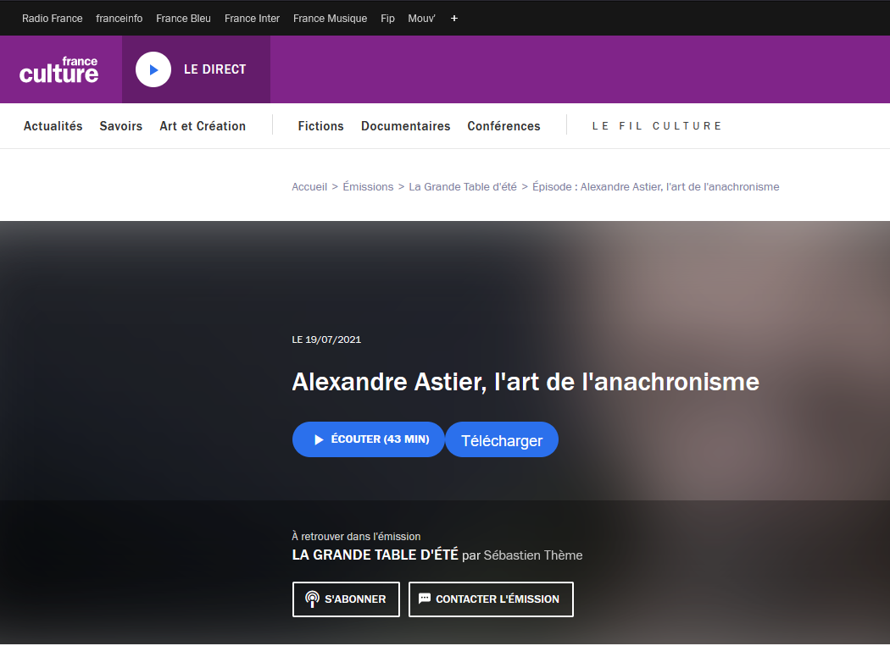

# France Culture Podcast Downloader
Ajoute pour télécharger les podcast audio de France Culture. Les fichiers téléchargés vont dans le dossier "Téléchargements" utilisé par le navigateur. Les téléchargements ne s'exécutent pas en parallèle, mais les uns après les autres.

# Installer
### Firefox
- `about:debugging#/runtime/this-firefox`
- "Charger un module complémentaire temporaire".
- Sélectionner n'importe quel fichier de ce dossier.

# Développement

## Debugguer
### Firefox
- `about:debugging#/runtime/this-firefox`
- "Charger un module complémentaire temporaire".
- Sélectionner n'importe quel fichier de ce dossier.
- "Examiner".

## Déployer une nouvelle version
### Firefox
- Récupérer la clef d'API et l'API Secret: https://addons.mozilla.org/fr/developers/addon/api/key/
- Installer web-ext: `npm install --global web-ext`.
- Builder avec signature: `web-ext sign --api-key=$AMO_JWT_ISSUER --api-secret=$AMO_JWT_SECRET`

## Todo
- Appliquer les tags (ID3v2) sur le fichier mp3 pour qu'il soit classé correctement.
- Permettre de choisir le dossier dans lequel enregistrer.
- Afficher une notification lorsqu'un télécharement est "enregistré", "démarré", "terminé" ou "en erreur".